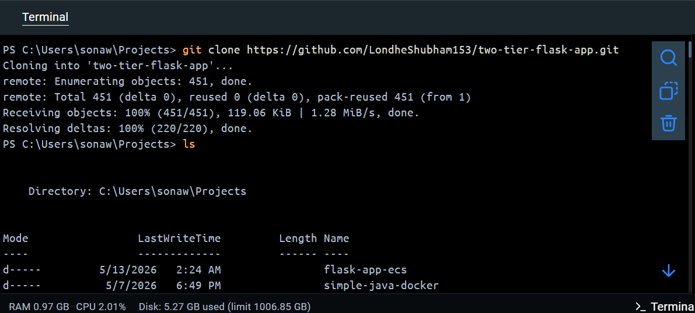
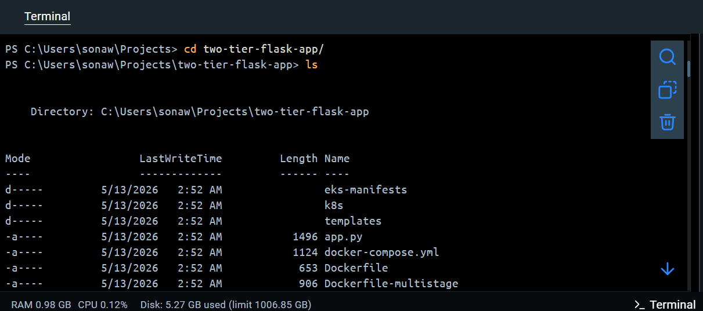
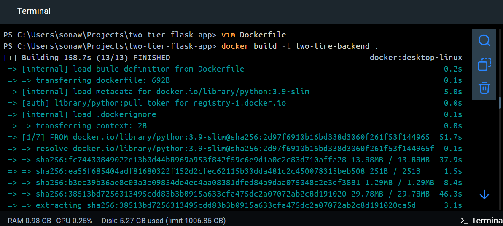
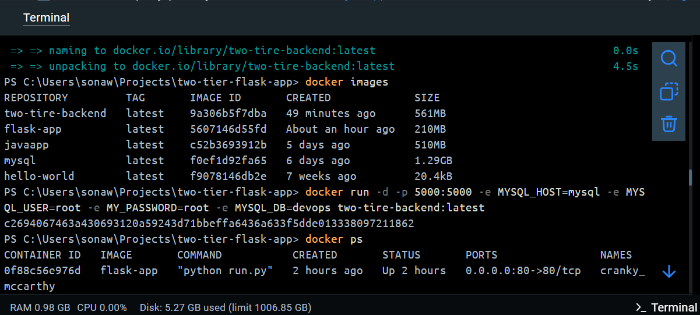
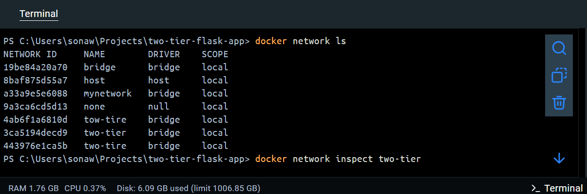
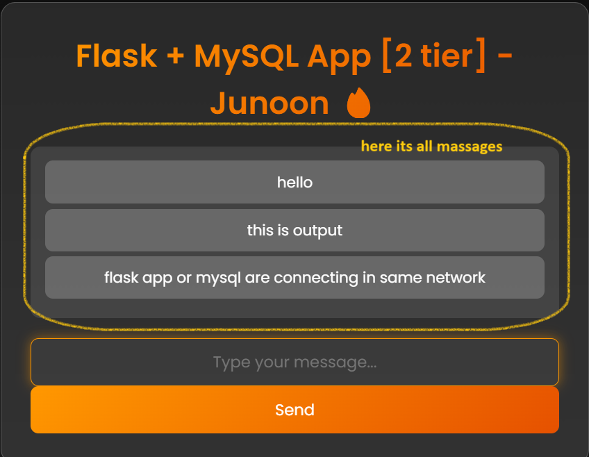
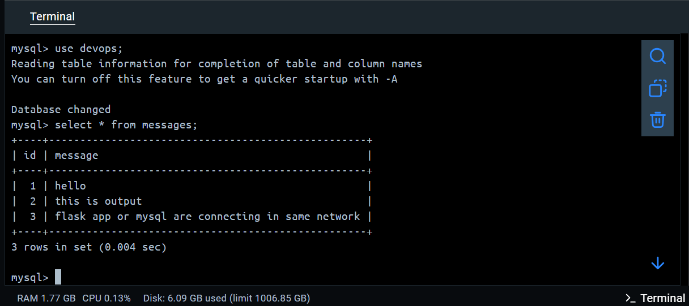

# 🐳 Day 05 — Docker Networking + Two-Tier Flask App

> 📅 **30 Days of DevOps** | Day 5 of 30
> 🎥 Reference: [TrainWithShubham — Docker In One Shot](https://www.youtube.com/@TrainWithShubham)
> 👤 By: **devopswithpallavi**

---

## 🏗️ Architecture

```
┌──────────────────────────────────────────┐
│         Docker Network: two-tier          │
│                                          │
│   ┌─────────────┐      ┌─────────────┐   │
│   │  Flask App  │ ───► │  MySQL DB   │   │
│   │  port 5000  │      │  port 3306  │   │
│   └─────────────┘      └─────────────┘   │
└──────────────────────────────────────────┘
```

---

## 🚀 How to Run This Project

### Prerequisites
- Docker installed on your machine
- Git installed

### Step 1 — Clone the repo
```bash
git clone https://github.com/LondheShubham153/two-tier-flask-app.git
cd two-tier-flask-app
```

### Step 2 — Build Docker image
```bash
docker build -t two-tire-backend .
```

### Step 3 — Create custom Docker network
```bash
docker network create two-tier
```

### Step 4 — Run MySQL container
```bash
docker run -d --name mysql \
  --network two-tier \
  -e MYSQL_ROOT_PASSWORD=root \
  -e MYSQL_DATABASE=devops \
  mysql
```

### Step 5 — Run Flask app container
```bash
docker run -d -p 5000:5000 \
  --network two-tier \
  -e MYSQL_HOST=mysql \
  -e MYSQL_USER=root \
  -e MYSQL_PASSWORD=root \
  -e MYSQL_DB=devops \
  two-tire-backend:latest
```

### Step 6 — Open in browser
```
http://localhost:5000
```

> 💡 **Note:** Both MySQL and Flask containers must be on the **same network**. `MYSQL_HOST=mysql` refers to the container name — Docker DNS resolves it automatically!

---

## 🛑 How to Stop

```bash
# Stop all containers
docker stop mysql
docker stop <flask_container_name>

# Remove containers
docker rm mysql
docker rm <flask_container_name>

# Remove network
docker network rm two-tier
```

---

## 🐙 Using Docker Compose (Easier Way!)

Start everything with a single command:

```bash
docker compose up -d
```

Stop everything:
```bash
docker compose down
```

---

## ✅ What I Did Today

| # | Task | Status |
|---|------|--------|
| 1 | Cloned `two-tier-flask-app` from GitHub | ✅ |
| 2 | Built Docker image (Python 3.9-slim base) | ✅ |
| 3 | Created custom Docker bridge network `two-tier` | ✅ |
| 4 | Ran MySQL container on the network | ✅ |
| 5 | Connected Flask app to MySQL via container name | ✅ |
| 6 | Verified app at `localhost:5000` | ✅ |
| 7 | Confirmed data stored in MySQL with SQL query | ✅ |
| 8 | Debugged container errors using `docker logs` | ✅ |

---

## 📸 Screenshots

### Git Clone


### Project Files


### Docker Build


### App Running at localhost:5000


### Docker Network Inspect


### Messages Saved in App


### MySQL Data Verified


---

## 🗄️ MySQL Output

```sql
mysql> use devops;
mysql> select * from messages;
+----+---------------------------------------------------+
| id | message                                           |
+----+---------------------------------------------------+
|  1 | hello                                             |
|  2 | this is output                                    |
|  3 | flask app or mysql are connecting in same network |
+----+---------------------------------------------------+
3 rows in set (0.004 sec)
```

---

## 💡 Key Concepts Learned

| Concept | What I Learned |
|---------|----------------|
| 🌐 Docker Networking | Containers communicate via custom bridge network |
| 🔍 Container DNS | Use container name as hostname — no IP needed! |
| 🔐 Environment Variables | Pass DB credentials securely via `-e` flags |
| 🏗️ Two-Tier Architecture | App & DB running in separate containers |
| 🐛 docker logs | Debug container crashes from terminal |
| 🔎 network inspect | Verify which containers are on a network |
| 🐙 Docker Compose | Run multi-container apps with one command |

---

## 🔗 Resources

- [TrainWithShubham YouTube](https://www.youtube.com/@TrainWithShubham)
- [Original Project Repo](https://github.com/LondheShubham153/two-tier-flask-app)
- [My GitHub](https://github.com/devopswithpallavi/30-days-of-devops)
